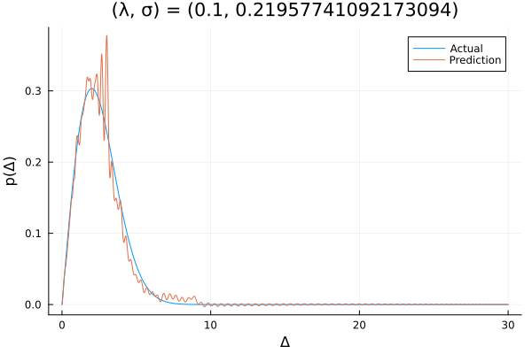

# SchottkyAnoMaLy.jl

A lightweight package to solve for level-splitting distributions from measured specific heat data via supervised machine learning.

**Disclaimer:** This package is still in an experimental phase is is subject to change frequently, likely with breaking changes.

